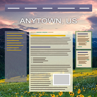
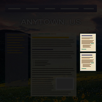
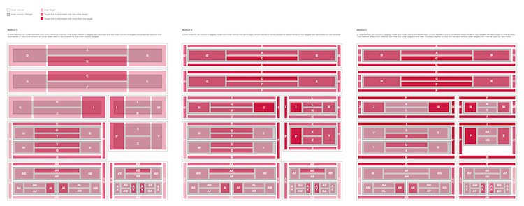

At [CivicPlus](http://civicplus.com), we help government work better by building websites^[We don’t just make [websites](http://www.civicplus.com/government-website-design-civicengage). We also build [other](http://www.civicplus.com/civicready-emergency-notification-system) [products](http://www.civicplus.com/human-resource-software-local-government) that help government work better.] for municipalities like cities &amp; counties. Over the years, we had developed a process not unlike an assembly line, with the site going from Design &rarr; Web Administrators &rarr; Content Development in a strictly linear fashion. Any kind of back-and-forth was considered a failure in the process, as it _always_ resulted in more time. Worse, each department had evolved its own efficiencies unique to this process to speed things up as much as possible. Design was creating pixel-perfect comps of highly-static, fixed-width sites that looked very similar to one another, so as to reduce the work of the Web Admins. After those comps were approved by the client, Web Admins would build the site using an antiquated system of textboxes for HTML snippets and directly-edited database tables that would output a `table`-based layout filled with _lots_ of extraneous markup.

When the time came to start building responsive sites, something for which I had spent years advocating, the process became completely unsustainable. We needed a way to maintain our production speed and quality, while allowing for back-and-forth between departments and a much more flexible and varied output. I worked with one of our Product Engineering teams to make a new system to meet these challenges, which changed the way we do just about every single aspect of the business, from Sales to Support.

The key to this new system is a separation of concerns illustrated above. We separated the structure of the site into **Layouts**, the look-and-feel into **Themes**, and the actual content into **Widgets**. This made each component reusable in only the ways it needed to be and, crucially, allowed us to offer built-in responsiveness instead of requiring a custom solution for each site.

**Layouts** are an XML representation of a traditional wireframe for the site. They describe which Containers (more on those in a bit) exist and in which arrangement. They also define the major media query breakpoints (e.g. when the sidebar of a site moves from under the main content to beside it) for the site and are _highly_ reusable. We chose XML because it is highly expressive, easily updated and understood, and easy to validate, to prevent errors early in the process. Because Layouts are completely separated from the look-and-feel and content of the site, they can be re-used with little to no effort. After building our first few sites using the new system, which I carefully supervised, we built up a nice library of common site layout patterns, codified into Layouts. For the next six months, I continued to regularly review Design’s comps and offer feedback and suggestions to ensure they used their new capabilities to their best and fullest potential.

**Themes** provide the aesthetic of the site, the fonts, colors, textures, spacing, etc... Importantly, they do not require the user to even think about responsiveness, since that is handled by the Layout and Widgets. Rather than forcing Web Admins to write the CSS for these Themes by hand, we built a <abbr title="What you see is what you get">WYSIWYG</abbr> interface to more efficiently translate the comp from Design into a working site.

This decision provided a lot of wins:{.cf}

1. Web Admins are able to build and apply a design to a site so quickly that we are now able to have the client approve the actual site in a browser, which is much more realistic than an idealized Photoshop comp.
2. Designers and Admins no longer have to rely on a pixel-perfect comp, which encourages collaboration that results in much more creative, inventive, and varied site designs.
3. The separation of aesthetic from structure and content allows us to redesign a site without migrating any content, which was previously impossible.
3. While Themes are too specific to an individual site to be shared with another site, a site’s multiple Themes are often quite similar and our interface allows for easy modification of one or more Themes simultaneously.

Finally, we have **Widgets**, which hold the content. Layouts are made of Containers, which hold a grid into which the client can drag-and-drop Widgets. This is the biggest improvement over the previous system. Previously, clients did not have access to anything other than the main content area of a page, requiring an email or phone call to Support just to switch out some content in their sidebar. Now, not only do they have that access, but we reduced a 17-step process across five screens to a simple drag-and-drop action and a popup to quickly configure the new Widget’s options. (Well, simple from the author’s perspective. As you can see in the figure below, it’s anything but simple.) There are Widgets for all types of content. To name a few: a full-featured <abbr title="What you see is what you get">WYSIWYG</abbr> editor; a quick, easy way to build a fully-responsive data table; drop-in images and slideshows; and a multitude of “Module Widgets”, which dynamically pull in content from other areas of the site.

<figure>
  
  <figcaption>One of many sketches to figure out how the drag-and-drop should operate. We opted for the third scenario, on the right.</figcaption>
</figure>

We quickly realized that media queries on Layouts alone was not enough to properly display the large variety of content available in the Widgets. So we built an element query^[The name has since changed to [“container query”](http://alistapart.com/article/container-queries-once-more-unto-the-breach), but I‘m using the original name here to avoid confusion with our Containers.] library and applied it to both the Container grids and the Widgets themselves. Now Containers and Widgets can have their own configurable media query breakpoints to arrange stacked Widgets side-by-side or to split a Widget’s list of items into multiple columns, when there’s sufficient width to do so. By applying it in a mobile-first manner, we achieved both a highly performant and highly flexible solution that displays every piece of content appropriately.

This new system has now been in use for two years. In that time, we’ve been able to move from 0% of our sites being responsive to over half, and the project is considered a massive success. Our sites are now responsive by default, faster, more accessible, more easily updated, more creatively designed, and much more quickly built.
