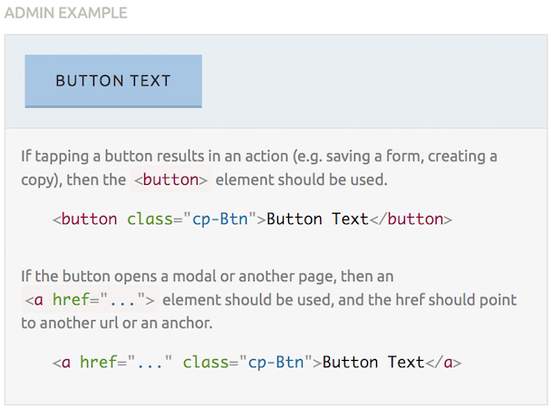
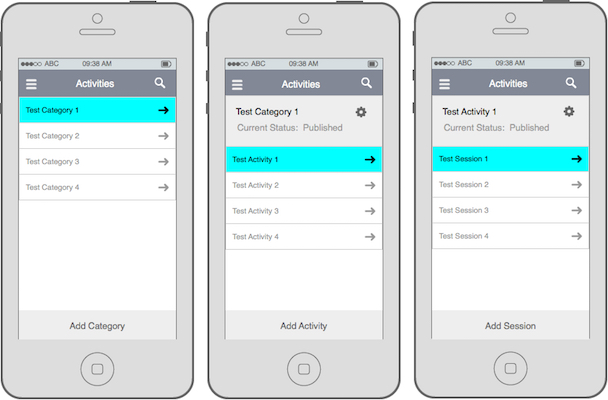
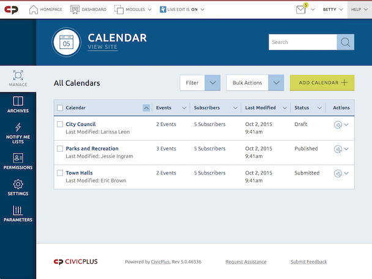

At [CivicPlus](http://civicplus.com), the administrative UI for our CMS was starting to look and feel stale and sluggish, and clients were beginning to ask about using it on their phones and tablets. Leadership decided the functionality should mostly remain the same, but gave us complete freedom to rebuild the entire interface from a UX and design perspective, with the primary goals of making it easier to use, faster, responsive, and require fewer support requests.

I worked with our UX Designer and development team to design and build the new UI and front-end architecture. As we started, I championed the need for a dynamic design system that would be the source of all of the various design patterns necessary for the build. After explaining the benefits, including faster QA regression testing, much easier maintainability, and enforced design &amp; code consistency, I had no problem persuading leadership to buy in.

<figure class="right@sm w-50@sm push@md">
  
  <figcaption>A standard button, as defined in the style guide</figcaption>
</figure>

The design system, and therefore the product, is built with Angular & Sass. The development team handled the former while I alone handled the latter. The Sass code has a base layer, an admin layer, and a “public” layer, the last of which I built in preparation for a future project to overhaul our citizen-facing UI. It is also quickly and easily theme-able, thanks to some custom mixins and a strict adherence to [<abbr title="Block Element Modifier">BEM</abbr>](http://csswizardry.com/2013/01/mindbemding-getting-your-head-round-bem-syntax/)^[The [official resource for BEM](https://en.bem.info/) isn’t nearly as understandable as the article I linked to above. It also goes way beyond the scope of CSS.] principles. This was also my first real foray into using an SVG icon system, which beautifully matches the bold, flat look and significantly reduced both the size and number of requests for images.

<figure class="left@sm w-50@sm pull@md">
  
  <figcaption>“Mobile” wireframes for one of the modules in the CMS; <em>not my work</em></figcaption>
</figure>

With the design system in place, I could begin to take the wireframes of “desktop” and “mobile” screens provided by our UX designer and translate them into real, working markup. This required a lot of collaboration with both the designer and the development team, as there were significant constraints from both sides and decisions frequently affected each of them in complex ways. It also required a large amount of ingenuity. Nothing was specified for the widths between “desktop” and ”mobile”, so it was up to me to determine the design and code to make it work at all widths. I loved the challenge.

<figure>
  
  <figcaption>The completed calendar module, at “desktop” size</figcaption>
</figure>

The end result was released recently with the launch of a new Dashboard. It meets all of the goals for the project and our clients have been raving about how much they’re enjoying the significant improvement. It was such a success that we then quickly applied the aesthetic^[The architecture rewrite and responsiveness will take much more time and effort.] to our entire system, which was also met with praise, and the design system has been expanded to eventually drive every one of our products.
