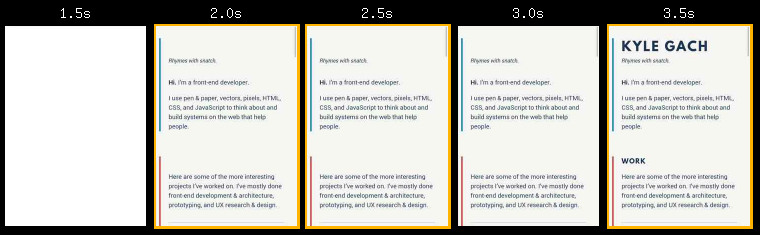
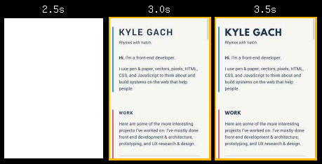
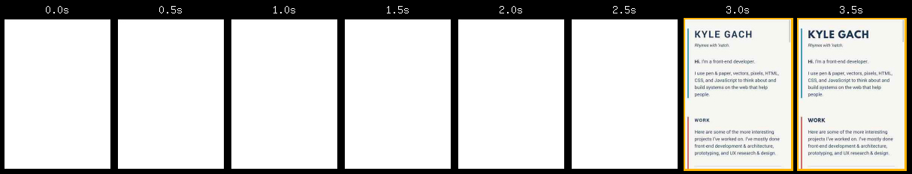

## Some things I already did

I purposefully did _not_ do many of the tasks below until I was able to write this post, because I wanted to measure the impact of each change and be able to explain each step. However, some things that help the performance of this site would’ve been too time-consuming to build “the slow way” first only to completely change them to make them faster later. For example:

1. This site is static, meaning that all of the pages are pre-rendered on the server and then served directly. Most websites have many back-and-forth requests with a server before presenting a page; this one does not, which speeds things up considerably. Serving static content typically saves ~500ms of loading time.
2. I’m using a webfont for the headings, but the body text uses a font stack that leverages the viewer’s system’s default font, which does not need to be loaded from the server.
3. The animations are built with SVG and driven by a ~40 Kb JS library. It would’ve been easier to just include them as gifs or videos, but that would’ve had much larger download costs.

Please see the [Colophon](/colophon/) for more details.

## Snapshot before any improvements

Before I do anything, let‘s get a snapshot of the current state of the site, to serve as a baseline. I‘m going to use the excellent [WebPageTest](http://www.webpagetest.org/) and [PageSpeed Insights](https://developers.google.com/speed/pagespeed/insights/) for this.

_Note: For all of the WebPageTest snapshots, I‘m testing the homepage of the site, three times, on a Motorola G in Chrome with a ‘3G - slow’ connection. The PageSpeed Insight snapshots are ran once, on the homepage._

<table>
	<thead>
		<tr>
			<th scope="col">Metric</th>
			<th scope="col">First View</th>
			<th scope="col">Repeat View</th>
		</tr>
	</thead>
	<tbody>
		<tr>
			<td>PageSpeed (Mobile)</td>
			<td colspan="2">68/100</td>
		</tr>
		<tr>
			<td>PageSpeed (Desktop)</td>
			<td colspan="2">71/100</td>
		</tr>
		<tr>
			<td>Speed Index (Mobile)</td>
			<td>2025</td>
			<td>511</td>
		</tr>
		<tr>
			<td>Load Time (Mobile)</td>
			<td>8.666s</td>
			<td>2.864s</td>
		</tr>
	</tbody>
	<caption>Summary of initial snapshot. <a href="http://www.webpagetest.org/result/160430_KW_176V/">Full results</a>.</caption>
</table>

While developing on my home’s broadband connection, I thought the site felt fairly zippy, but these baseline results make it clear that there’s plenty of room for improvement. Here’s a breakdown of the content being loaded:

<div class="cf">
	<figure class="left@md">
		<div dir="ltr" style="position: relative; width: 300px; height: 220px;">
				<div style="position: absolute; left: 0px; top: 0px; width: 100%; height: 100%;" aria-label="A chart.">
						<svg width="300" height="300" aria-label="A chart." style="overflow: hidden;">
								<rect x="0" y="0" width="300" height="220" stroke="none" stroke-width="0" fill="#ffffff"></rect>
								<g transform="translate(-75,-40)">
										<rect x="276" y="58" width="88" height="83" stroke="none" stroke-width="0" fill-opacity="0" fill="#ffffff"></rect>
										<g>
												<rect x="276" y="58" width="88" height="11" stroke="none" stroke-width="0" fill-opacity="0" fill="#ffffff"></rect>
												<g><text text-anchor="start" x="291" y="67.35" font-family="Arial" font-size="11" stroke="none" stroke-width="0" fill="#222222">css (1)</text></g>
												<circle cx="281.5" cy="63.5" r="5.5" stroke="none" stroke-width="0" fill="#b2ea94"></circle>
										</g>
										<g>
												<rect x="276" y="76" width="88" height="11" stroke="none" stroke-width="0" fill-opacity="0" fill="#ffffff"></rect>
												<g><text text-anchor="start" x="291" y="85.35" font-family="Arial" font-size="11" stroke="none" stroke-width="0" fill="#222222">font (1)</text></g>
												<circle cx="281.5" cy="81.5" r="5.5" stroke="none" stroke-width="0" fill="#ff523e"></circle>
										</g>
										<g>
												<rect x="276" y="94" width="88" height="11" stroke="none" stroke-width="0" fill-opacity="0" fill="#ffffff"></rect>
												<g><text text-anchor="start" x="291" y="103.35" font-family="Arial" font-size="11" stroke="none" stroke-width="0" fill="#222222">html (1)</text></g>
												<circle cx="281.5" cy="99.5" r="5.5" stroke="none" stroke-width="0" fill="#82b5fc"></circle>
										</g>
										<g>
												<rect x="276" y="112" width="88" height="11" stroke="none" stroke-width="0" fill-opacity="0" fill="#ffffff"></rect>
												<g><text text-anchor="start" x="291" y="121.35" font-family="Arial" font-size="11" stroke="none" stroke-width="0" fill="#222222">image (3)</text></g>
												<circle cx="281.5" cy="117.5" r="5.5" stroke="none" stroke-width="0" fill="#c49ae8"></circle>
										</g>
										<g>
												<rect x="276" y="130" width="88" height="11" stroke="none" stroke-width="0" fill-opacity="0" fill="#ffffff"></rect>
												<g><text text-anchor="start" x="291" y="139.35" font-family="Arial" font-size="11" stroke="none" stroke-width="0" fill="#222222">js (2)</text></g>
												<circle cx="281.5" cy="135.5" r="5.5" stroke="none" stroke-width="0" fill="#fec584"></circle>
										</g>
								</g>
								<g transform="translate(-80,-40)">
										<path d="M172,151L172,65A86,86,0,0,1,232.8111831820431,90.18881681795692L172,151A0,0,0,0,0,172,151" stroke="#ffffff" stroke-width="1" fill="#b2ea94"></path>
										<text text-anchor="start" x="180.60355104213698" y="96.6588801727207" font-family="Arial" font-size="11" stroke="none" stroke-width="0" fill="#ffffff">12.5%</text>
								</g>
								<g transform="translate(-80,-40)">
										<path d="M172,151L232.8111831820431,90.18881681795692A86,86,0,0,1,258,151L172,151A0,0,0,0,0,172,151" stroke="#ffffff" stroke-width="1" fill="#ff523e"></path>
										<text text-anchor="start" x="210.61189089455615" y="132.43612090582164" font-family="Arial" font-size="11" stroke="none" stroke-width="0" fill="#ffffff">12.5%</text>
								</g>
								<g transform="translate(-80,-40)">
										<path d="M172,151L258,151A86,86,0,0,1,232.8111831820431,211.81118318204307L172,151A0,0,0,0,0,172,151" stroke="#ffffff" stroke-width="1" fill="#82b5fc"></path>
										<text text-anchor="start" x="210.61189089455618" y="177.26387909417835" font-family="Arial" font-size="11" stroke="none" stroke-width="0" fill="#ffffff">12.5%</text>
								</g>
								<g transform="translate(-80,-40)">
										<path d="M172,151L86,151A86,86,0,0,1,172,65L172,151A0,0,0,0,0,172,151" stroke="#ffffff" stroke-width="1" fill="#fec584"></path>
										<text text-anchor="start" x="116.2883393387254" y="110.13833933872542" font-family="Arial" font-size="11" stroke="none" stroke-width="0" fill="#ffffff">25%</text>
								</g>
								<g transform="translate(-80,-40)">
										<path d="M172,151L232.8111831820431,211.81118318204307A86,86,0,0,1,86,151L172,151A0,0,0,0,0,172,151" stroke="#ffffff" stroke-width="1" fill="#c49ae8"></path>
										<text text-anchor="start" x="132.396448957863" y="213.0411198272793" font-family="Arial" font-size="11" stroke="none" stroke-width="0" fill="#ffffff">37.5%</text>
								</g>
						</svg>
						<div aria-label="A tabular representation of the data in the chart." style="position: absolute; left: -10000px; top: auto; width: 1px; height: 1px; overflow: hidden;">
								<table>
										<thead>
												<tr>
														<th>Content Type</th>
														<th>Requests</th>
												</tr>
										</thead>
										<tbody>
												<tr>
														<td>css</td>
														<td>1</td>
												</tr>
												<tr>
														<td>flash</td>
														<td>0</td>
												</tr>
												<tr>
														<td>font</td>
														<td>1</td>
												</tr>
												<tr>
														<td>html</td>
														<td>1</td>
												</tr>
												<tr>
														<td>image</td>
														<td>3</td>
												</tr>
												<tr>
														<td>js</td>
														<td>2</td>
												</tr>
												<tr>
														<td>other</td>
														<td>0</td>
												</tr>
										</tbody>
								</table>
						</div>
				</div>
		</div>
		<figcaption>First view content breakdown, by requests.</figcaption>
	</figure>
	<figure class="left@md mr-0">
		<div dir="ltr" style="position: relative; width: 300px; height: 220px;">
				<div style="position: absolute; left: 0px; top: 0px; width: 100%; height: 100%;" aria-label="A chart.">
						<svg width="300" height="220" aria-label="A chart." style="overflow: hidden;">
								<rect x="0" y="0" width="300" height="220" stroke="none" stroke-width="0" fill="#ffffff"></rect>
								<g transform="translate(-80,-40)">
										<rect x="276" y="58" width="88" height="83" stroke="none" stroke-width="0" fill-opacity="0" fill="#ffffff"></rect>
										<g>
												<rect x="276" y="58" width="88" height="11" stroke="none" stroke-width="0" fill-opacity="0" fill="#ffffff"></rect>
												<g><text text-anchor="start" x="291" y="67.35" font-family="Arial" font-size="11" stroke="none" stroke-width="0" fill="#222222">css (6.5 Kb)</text></g>
												<circle cx="281.5" cy="63.5" r="5.5" stroke="none" stroke-width="0" fill="#b2ea94"></circle>
										</g>
										<g>
												<rect x="276" y="76" width="88" height="11" stroke="none" stroke-width="0" fill-opacity="0" fill="#ffffff"></rect>
												<g><text text-anchor="start" x="291" y="85.35" font-family="Arial" font-size="11" stroke="none" stroke-width="0" fill="#222222">font (19.9 Kb)</text></g>
												<circle cx="281.5" cy="81.5" r="5.5" stroke="none" stroke-width="0" fill="#ff523e"></circle>
										</g>
										<g>
												<rect x="276" y="94" width="88" height="11" stroke="none" stroke-width="0" fill-opacity="0" fill="#ffffff"></rect>
												<g><text text-anchor="start" x="291" y="103.35" font-family="Arial" font-size="11" stroke="none" stroke-width="0" fill="#222222">html (7.92 Kb)</text></g>
												<circle cx="281.5" cy="99.5" r="5.5" stroke="none" stroke-width="0" fill="#82b5fc"></circle>
										</g>
										<g>
												<rect x="276" y="112" width="88" height="11" stroke="none" stroke-width="0" fill-opacity="0" fill="#ffffff"></rect>
												<g><text text-anchor="start" x="291" y="121.35" font-family="Arial" font-size="11" stroke="none" stroke-width="0" fill="#222222">image (402.1 Kb)</text></g>
												<circle cx="281.5" cy="117.5" r="5.5" stroke="none" stroke-width="0" fill="#c49ae8"></circle>
										</g>
										<g>
												<rect x="276" y="130" width="88" height="11" stroke="none" stroke-width="0" fill-opacity="0" fill="#ffffff"></rect>
												<g><text text-anchor="start" x="291" y="139.35" font-family="Arial" font-size="11" stroke="none" stroke-width="0" fill="#222222">js (196 Kb)</text></g>
												<circle cx="281.5" cy="135.5" r="5.5" stroke="none" stroke-width="0" fill="#fec584"></circle>
										</g>
								</g>
								<g transform="translate(-75,-40)">
										<path d="M172,151L172,65A86,86,0,0,1,177.51013461663786,65.17670236755914L172,151A0,0,0,0,0,172,151" stroke="#ffffff" stroke-width="1" fill="#b2ea94"></path>
								</g>
								<g transform="translate(-75,-40)">
										<path d="M172,151L177.51013461663786,65.17670236755914A86,86,0,0,1,194.3200144896735,67.94690280801827L172,151A0,0,0,0,0,172,151" stroke="#ffffff" stroke-width="1" fill="#ff523e"></path>
								</g>
								<g transform="translate(-75,-40)">
										<path d="M172,151L194.3200144896735,67.94690280801827A86,86,0,0,1,200.76344451294048,69.95270356297507L172,151A0,0,0,0,0,172,151" stroke="#ffffff" stroke-width="1" fill="#82b5fc"></path>
								</g>
								<g transform="translate(-75,-40)">
										<path d="M172,151L92.0313275160493,182.63876453268406A86,86,0,0,1,172,65L172,151A0,0,0,0,0,172,151" stroke="#ffffff" stroke-width="1" fill="#fec584"></path>
										<text text-anchor="start" x="109.06951167305932" y="119.5486073897865" font-family="Arial" font-size="11" stroke="none" stroke-width="0" fill="#ffffff">31%</text>
								</g>
								<g transform="translate(-75,-40)">
										<path d="M172,151L200.76344451294048,69.95270356297507A86,86,0,1,1,92.0313275160493,182.63876453268406L172,151A0,0,0,1,0,172,151" stroke="#ffffff" stroke-width="1" fill="#c49ae8"></path>
										<text text-anchor="start" x="199.4738779850747" y="196.31600465641716" font-family="Arial" font-size="11" stroke="none" stroke-width="0" fill="#ffffff">63.6%</text>
								</g>
								<g></g>
						</svg>
						<div aria-label="A tabular representation of the data in the chart." style="position: absolute; left: -10000px; top: auto; width: 1px; height: 1px; overflow: hidden;">
								<table>
										<thead>
												<tr>
														<th>Content Type</th>
														<th>Bytes</th>
												</tr>
										</thead>
										<tbody>
												<tr>
														<td>css</td>
														<td>6454</td>
												</tr>
												<tr>
														<td>flash</td>
														<td>0</td>
												</tr>
												<tr>
														<td>font</td>
														<td>19974</td>
												</tr>
												<tr>
														<td>html</td>
														<td>7901</td>
												</tr>
												<tr>
														<td>image</td>
														<td>402108</td>
												</tr>
												<tr>
														<td>js</td>
														<td>196044</td>
												</tr>
												<tr>
														<td>other</td>
														<td>0</td>
												</tr>
										</tbody>
								</table>
						</div>
				</div>
		</div>
		<figcaption>First view content breakdown, by bytes.</figcaption>
	</figure>
</div>

Typically, the first step in improving web performance is reducing the number of requests. For this relatively simple site, that number is already pretty low. There’s only one image on the page; the other two image requests are tiny and from Google Analytics. The JavaScript is all combined into one bundle except for the Google Analytics package, which is loaded asynchronously. I could embed the font file within the CSS, using base64 encoding, but, as we’ll see later, that would make things worse in other ways.

The next typical step is reducing the size of requests. That definitely applies here, so let’s dig in.

## Reducing the size of images

Before this exercise, the avatar image on the home page was a 639px&thinsp;&times;&thinsp;639px, 392 Kb PNG. It has a fixed-width of 150px in the design, so I resized to 300px&thinsp;&times;&thinsp;300px^[The dimensions are doubled to account for retina screens.], and [optimized](https://imageoptim.com) it while converting to JPEG, which brought it down to 70 Kb.

But I can do more. Not every screen is retina, so I need to serve the smaller, non-retina version by default, then use [`srcset`](http://blog.cloudfour.com/responsive-images-101-part-3-srcset-display-density/) to serve the retina version to screens that need it:

```html

```

And the result:

<table>
	<thead>
		<tr>
			<th scope="col">Metric</th>
			<th scope="col">First View</th>
			<th scope="col">Repeat View</th>
		</tr>
	</thead>
	<tbody>
		<tr>
			<td>PageSpeed (Mobile)</td>
			<td colspan="2">90/100 (+22)</td>
		</tr>
		<tr>
			<td>PageSpeed (Desktop)</td>
			<td colspan="2">96/100 (+25)</td>
		</tr>
		<tr>
			<td>Speed Index (Mobile)</td>
			<td>2056 (+1.5%)</td>
			<td>498 (-2.5%)</td>
		</tr>
		<tr>
			<td>Load Time (Mobile)</td>
			<td>8.666s (-16.2%)</td>
			<td>2.864s (+1.01%)</td>
		</tr>
	</tbody>
	<caption>Summary of snapshot after optimizing images. <a href="http://www.webpagetest.org/result/160501_ND_TS/">Full results</a>.</caption>
</table>

I’m not sure why the speed index on the first view and load time on the repeat view both went up slightly, but it’s such a small change that I’m not too concerned. Those oddities aside, this simple optimization resulted in big, easy speed wins.

And here’s the new breakdown:

<figure>
	<div dir="ltr" style="position: relative; width: 300px; height: 220px;">
			<div aria-label="A chart." style="position: absolute; left: 0px; top: 0px; width: 100%; height: 100%;">
					<svg width="300" height="220" aria-label="A chart." style="overflow: hidden;">
							<rect x="0" y="0" width="300" height="220" stroke="none" stroke-width="0" fill="#ffffff"></rect>
							<g transform="translate(-80,-40)">
									<rect x="276" y="58" width="88" height="83" stroke="none" stroke-width="0" fill-opacity="0" fill="#ffffff"></rect>
									<g>
											<rect x="276" y="58" width="88" height="11" stroke="none" stroke-width="0" fill-opacity="0" fill="#ffffff"></rect>
											<g><text text-anchor="start" x="291" y="67.35" font-family="Arial" font-size="11" stroke="none" stroke-width="0" fill="#222222">css (6.5 Kb)</text></g>
											<circle cx="281.5" cy="63.5" r="5.5" stroke="none" stroke-width="0" fill="#b2ea94"></circle>
									</g>
									<g>
											<rect x="276" y="76" width="88" height="11" stroke="none" stroke-width="0" fill-opacity="0" fill="#ffffff"></rect>
											<g><text text-anchor="start" x="291" y="85.35" font-family="Arial" font-size="11" stroke="none" stroke-width="0" fill="#222222">font (19.9 Kb)</text></g>
											<circle cx="281.5" cy="81.5" r="5.5" stroke="none" stroke-width="0" fill="#ff523e"></circle>
									</g>
									<g>
											<rect x="276" y="94" width="88" height="11" stroke="none" stroke-width="0" fill-opacity="0" fill="#ffffff"></rect>
											<g><text text-anchor="start" x="291" y="103.35" font-family="Arial" font-size="11" stroke="none" stroke-width="0" fill="#222222">html (7.92 Kb)</text></g>
											<circle cx="281.5" cy="99.5" r="5.5" stroke="none" stroke-width="0" fill="#82b5fc"></circle>
									</g>
									<g>
											<rect x="276" y="112" width="88" height="11" stroke="none" stroke-width="0" fill-opacity="0" fill="#ffffff"></rect>
											<g><text text-anchor="start" x="291" y="121.35" font-family="Arial" font-size="11" stroke="none" stroke-width="0" fill="#222222">image (70.1 Kb)</text></g>
											<circle cx="281.5" cy="117.5" r="5.5" stroke="none" stroke-width="0" fill="#c49ae8"></circle>
									</g>
									<g>
											<rect x="276" y="130" width="88" height="11" stroke="none" stroke-width="0" fill-opacity="0" fill="#ffffff"></rect>
											<g><text text-anchor="start" x="291" y="139.35" font-family="Arial" font-size="11" stroke="none" stroke-width="0" fill="#222222">js (196 Kb)</text></g>
											<circle cx="281.5" cy="135.5" r="5.5" stroke="none" stroke-width="0" fill="#fec584"></circle>
									</g>
							</g>
							<g transform="translate(-80,-40)">
									<path d="M172,151L172,65A86,86,0,0,1,183.80813767046166,65.81450895395729L172,151A0,0,0,0,0,172,151" stroke="#ffffff" stroke-width="1" fill="#b2ea94"></path>
							</g>
							<g transform="translate(-80,-40)">
									<path d="M172,151L183.80813767046166,65.81450895395729A86,86,0,0,1,217.36564337247916,77.93866685173997L172,151A0,0,0,0,0,172,151" stroke="#ffffff" stroke-width="1" fill="#ff523e"></path>
							</g>
							<g transform="translate(-80,-40)">
									<path d="M172,151L217.36564337247916,77.93866685173997A86,86,0,0,1,228.79610027103274,86.4228910990683L172,151A0,0,0,0,0,172,151" stroke="#ffffff" stroke-width="1" fill="#82b5fc"></path>
							</g>
							<g transform="translate(-80,-40)">
									<path d="M172,151L228.79610027103274,86.4228910990683A86,86,0,0,1,242.1691060513362,200.72219379669738L172,151A0,0,0,0,0,172,151" stroke="#ffffff" stroke-width="1" fill="#c49ae8"></path>
									<text text-anchor="start" x="214.97755276961263" y="148.00813279040895" font-family="Arial" font-size="11" stroke="none" stroke-width="0" fill="#ffffff">23.3%</text>
							</g>
							<g transform="translate(-80,-40)">
									<path d="M172,151L242.1691060513362,200.72219379669738A86,86,0,1,1,172,65L172,151A0,0,0,1,0,172,151" stroke="#ffffff" stroke-width="1" fill="#fec584"></path>
									<text text-anchor="start" x="104.38135169191824" y="181.79562221607026" font-family="Arial" font-size="11" stroke="none" stroke-width="0" fill="#ffffff">65.2%</text>
							</g>
							<g></g>
					</svg>
					<div aria-label="A tabular representation of the data in the chart." style="position: absolute; left: -10000px; top: auto; width: 1px; height: 1px; overflow: hidden;">
							<table>
									<thead>
											<tr>
													<th>Content Type</th>
													<th>Bytes</th>
											</tr>
									</thead>
									<tbody>
											<tr>
													<td>css</td>
													<td>6583</td>
											</tr>
											<tr>
													<td>flash</td>
													<td>0</td>
											</tr>
											<tr>
													<td>font</td>
													<td>19974</td>
											</tr>
											<tr>
													<td>html</td>
													<td>7920</td>
											</tr>
											<tr>
													<td>image</td>
													<td>70060</td>
											</tr>
											<tr>
													<td>js</td>
													<td>195757</td>
											</tr>
											<tr>
													<td>other</td>
													<td>0</td>
											</tr>
									</tbody>
							</table>
					</div>
			</div>
	</div>
	<figcaption>First view content breakdown after optimizing images, by bytes.</figcaption>
</figure>

[Performance commit #1](https://github.com/kylegach/kylegach_com/commit/b911321f418feb78f7f11f6466e23bdaea4c0d9d)

_Note: Even though I’m only testing the homepage, I went ahead and did this exercise for all images on the site._

## Reducing the size of JavaScript and other resources

190 Kb of JavaScript is quite a lot, especially since that size is after gzipping. For now, though, I’m going to leave it be, as I would like to see how fast I can make this site while it still runs React client-side. I suspect that I’ll need to remove React to meet my informal goal of a speed index under 1000, but I’ll save that for last.

My CSS is only 6.5 Kb (gzipped). At that size, that’s too small to justify the effort to make it any smaller^[You should always endeavor to keep your CSS as small and simple as you reasonably can. The effort I’m avoiding here is because my styles are already [architected in a way to keep them very small](http://mrmrs.io/writing/2016/03/24/scalable-css/). Any further optimization will require either a lot of manual fine-tuning that could break future updates or an automated process using something like [PurifyCSS](https://github.com/purifycss/purifycss). I intend to implement the latter in a future post.]. There are other reasons being the filesize to make CSS as small as possible, which I’ll cover later in this post.

## Absolute vs. perceived performance

So far, I’ve only made changes that affected the page load time/size, which correlates to the **absolute** page speed. But that’s not all that matters. Arguably, [**perceived** performance](http://blog.teamtreehouse.com/perceived-performance) matters even more, as that affects how fast your site _feels_.

For example, check out this filmstrip view of a portion of the experience waiting for the site to load on 3G:



There’s a full 1.5 seconds between the initial content displaying and the webfont displaying. Worse, because I reference the webfont directly in CSS, via `@font-face`, there’s a <abbr title="Flash of Invisible Text">FOIT</abbr> making the headings completely unreadable until the webfont has finished loading. This is unacceptable.

## Preventing a Flash of Invisible Text (FOIT)

I’m going to use [FontFaceObserver](https://github.com/bramstein/fontfaceobserver) to instead only apply the webfont to headings after it is loaded. While it is loading, they’ll use the same font stack as the body text, changing the <abbr title="Flash of Invisible Text">FOIT</abbr> into a <abbr title="Flash of Unstyled Text">FOUT</abbr>. In some scenarios, this can provide a poor experience just like a <abbr title="Flash of Invisible Text">FOIT</abbr>, but I have a couple things going for me:

1. The body text is set in a font that doesn’t have to load at all, meaning it will display correctly immediately. So when the headings also use that font while the web font loads, they’ll match the rest of the site.
2. The webfont I’ve chosen for the headings, League Spartan, has a very similar baseline &amp; caps height, so shifts after the webfont loads are minimal.

After making the change, the [filmstrip](http://www.webpagetest.org/video/compare.php?tests=160501_Q3_SH8-r:2-c:0) now looks like:



Much better! You can see how the headings now display for a brief moment using the same font as the rest of the text, and then switch to the webfont after it has finished loading.

[Performance commit #2](https://github.com/kylegach/kylegach_com/commit/6e9d316bff15a86262cd3abad7ed90102796e263)

## Clearing the critical path

What you can’t see in the filmstrips above is all that time before anything is visible:



Part of that is because it must download the full CSS file before it displays anything. In other words, the [CSS is blocking the critical path](https://developers.google.com/web/fundamentals/performance/critical-rendering-path/render-blocking-css?hl=en), which happens regardless of the file’s size. So even though the size is fairly small, it has an outsized effect on the perceived performance of the site.

I’ll cover my approach for solving that issue (and possibly removing React on the client-side) in a future post.
